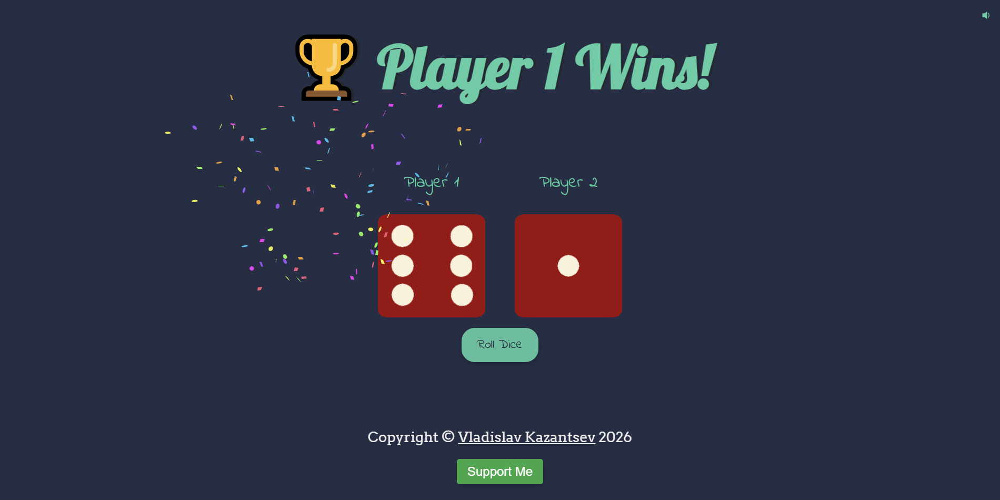

# Dice Game

&nbsp;&nbsp;Welcome to the **Dice Game** project! This interactive web application allows to roll dice and see who gets the higher number. It's a simple yet fun game that can be enjoyed by players of all ages.

&nbsp;&nbsp;**<a href="https://primesolar.github.io/dice-game/" target="_blank" rel="noopener noreferrer">Play the Dice Game!</a>**

- [Dice Game](#dice-game)
  - [Interface](#interface)
  - [Features](#features)
  - [Technologies Used](#technologies-used)
  - [Installation](#installation)
  - [Usage](#usage)
  - [Code Attribution](#code-attribution)
  - [Support My Work ☕](#support-my-work-)
  - [Contact Me](#contact-me)

## Interface

&nbsp;&nbsp;The interface is designed to be user-friendly and visually appealing.

<!--prettier-ignore-->

<p align="center"><em>The Dice Game Interface</em></p>

## Features

- Roll dice.
- Display the result of each roll.
- Sound control feature to toggle a sound effect.
- Fun animations with confetti on winning.

## Technologies Used

- **JavaScript**: for dynamic content updates and user interactions, providing a smooth and interactive experience.
- **HTML5**: for structuring the web application, ensuring semantic markup and improved SEO.
- **CSS3**: for styling and layout, including responsive design techniques that enhance user experience across devices.

## Installation

&nbsp;&nbsp;To get started with the Dice Game project, follow these steps:

1. Ensure you have Git installed on your system. If you haven't installed it yet, you can download it from [git-scm.com](https://git-scm.com/). Once Git is installed, open a terminal window and **run the following command** to clone the repository:

```bash
git clone https://github.com/PrimeSolar/dice-game.git
```

2. **Navigate to the project directory** on your local device.

3. **Open the `index.html` file** in your web browser.

## Usage

1. Click the "Roll Dice" button to roll the dice.
2. The results will be displayed, showing who won.
3. Use the sound control button to toggle the sound effect.

## Code Attribution

&nbsp;&nbsp;This project utilizes powerful libraries and resources to enhance functionality and ensure consistent styling across different browsers:

- **Google Fonts - Arvo**

  - **Author**: Anton Koovit
  - **License**: The SIL Open Font License
  - **Link**: [Google Fonts - Arvo](https://fonts.google.com/specimen/Arvo)
  - **License Text**: [The SIL Open Font License](https://openfontlicense.org/)

- **Google Fonts - Lobster**

  - **Author**: Pablo Impallari
  - **License**: The SIL Open Font License
  - **Link**: [Google Fonts - Lobster](https://fonts.google.com/specimen/Lobster)
  - **License Text**: [The SIL Open Font License](https://openfontlicense.org/)

- **Canvas Confetti**

  - **Author**: Kiril Vatev
  - **License**: ISC License
  - **Link**: [Canvas Confetti on jsDelivr](https://www.jsdelivr.com/package/npm/canvas-confetti)
  - **License Text**: [ISC License](https://cdn.jsdelivr.net/npm/canvas-confetti@1.9.3/LICENSE)

- **Sound Effect**
  - **Author**: u_qpfzpydtro
  - **License**: Content License
  - **Link**: [Pixabay](https://pixabay.com/users/u_qpfzpydtro-29496424/)
  - **License Text**: [Content License](https://pixabay.com/service/terms/)

## Support My Work ☕

If you enjoy my project and would like to support my work, consider buying me a coffee! Your contributions help me stay energized and motivated to create even more amazing content.

Every cup of coffee you buy not only fuels my passion but also allows me to dedicate more time to developing innovative projects and sharing knowledge. Whether it's a small gesture or a generous contribution, every bit is greatly appreciated!

**Click the image to support my work:**

<a href="https://coff.ee/cocacola" rel="noopener noreferrer">
    
</a>

Thank you for your support! Together, we can create something wonderful! 💖

**Copyright Notice**

Copyright © Vladislav Kazantsev
All rights reserved.
This repository contains the intellectual property of Vladislav Kazantsev, including the code and related files.
You are welcome to clone this repository and use the code for exploratory purposes.
However, unauthorized reproduction, modification, or redistribution of this code (including cloning of this repository or altering it for activities beyond exploratory use) is strictly prohibited.
Code snippets may be shared only when the original author is explicitly credited and a direct link to the original source of the code is provided alongside the code snippet.
Sharing links to the repository or its files is permitted, except when directed toward retrieval purposes.
Any form of interaction with this repository or its files is strictly prohibited when facilitated by the code, except when such interaction is for discussion or exchange purposes with others.
This copyright notice applies globally.
Email address for inquiries about collaboration, usage outside exploratory purposes, or permissions: [hypervisor7@pm.me](mailto:hypervisor7@pm.me)

<a name="contact-me"></a>

## Contact Me

&nbsp;&nbsp;LinkedIn [@PepsiCo](https://www.linkedin.com/in/PepsiCo/)


